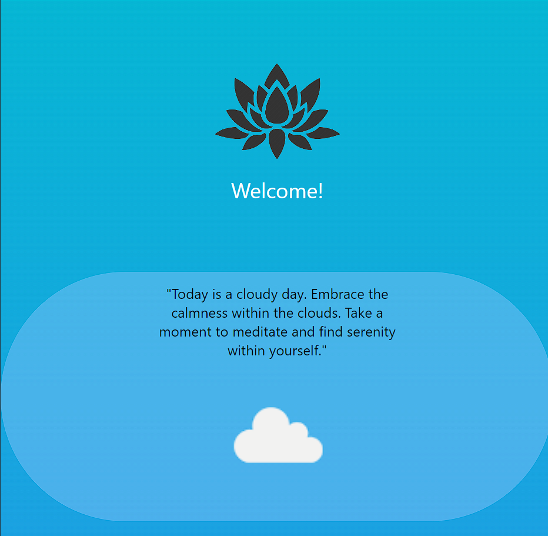
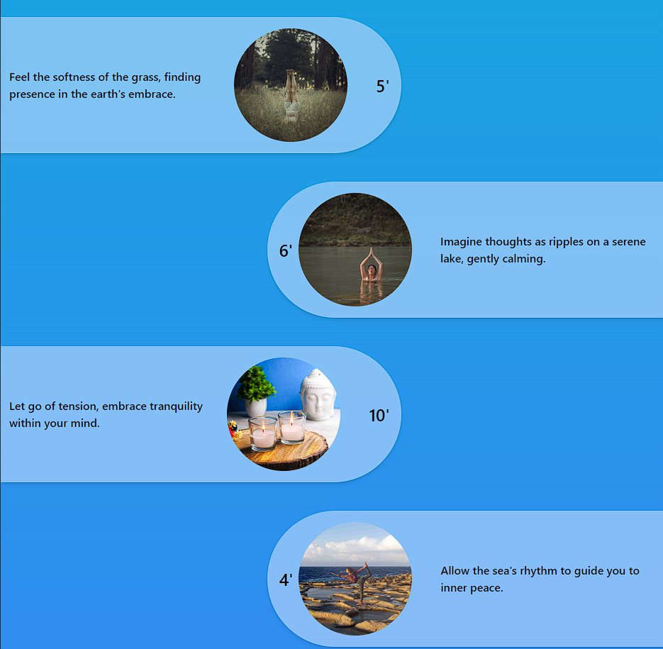
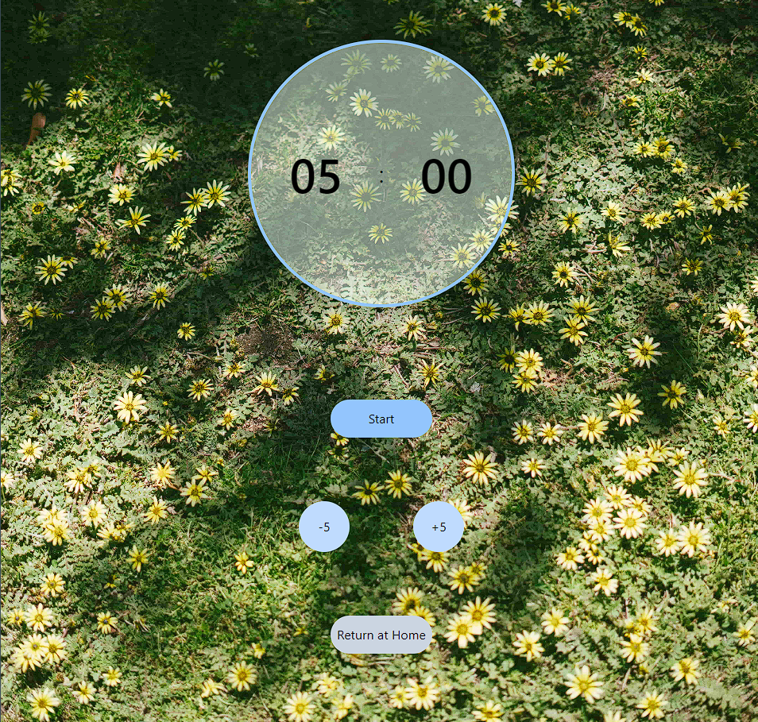

# ZenSoul

ZenSoul is a simple meditation app that offers a variety of preset meditation exercises based on different types of environments. Users can choose from these exercises to enhance their meditation practice. Additionally, ZenSoul provides a personalized meditation experience based on the user's current weather conditions.

## Technologies Used

## Live Demo

https://zen-soul-wsmomo.vercel.app/

## Installation

- 1.Clone the repository using 'git clone https://github.com/WSMomo/ZenSoul.git';
- 2.Install the dependencies with 'npm install';
- 3.Run the program with 'npm run dev';

## Screenshots

